# amazonTerminal
The amazon Terminal is mock sales and inventory tracking node.js program that offers three perspectives of the database.  The customer, the manager, and the supervisor.

**Using NPM packages:**
mysql, table, inquirer

This project is useful for entering in and tracking inventory and sales.

You can get started by simply adding your own npm files and calling the file you wish to use in the command terminal with node.

This project is contributed to and maintained by **Matthew Madison**

## WALKTHROUGH

amazonTerminal has three programs: one for the customer,
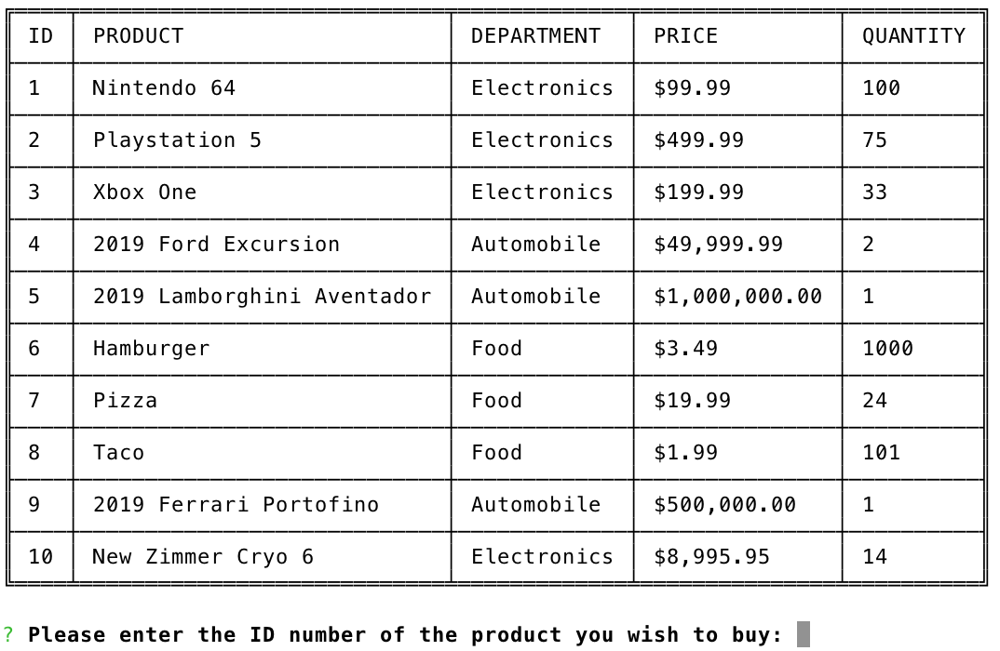

one for the manager
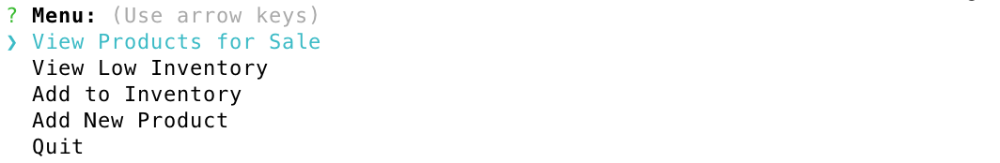

and one for the supervisor
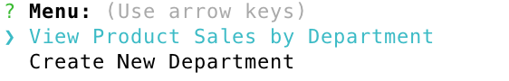

All three programs have different functions but work with the same database.  The supervisor has two options.  First the supervisor can **View Product Sales by Department** which renders a table that shows the Department ID, Department Name, Overhead Costs, Product Sales, and Total Profit of each department.
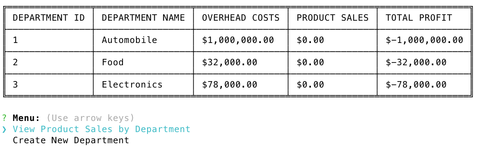

The second available function for the Supervisor is to **Create New Deparment**.  This function prompts the supervisor for the Department Name and Overhead Costs and then inserts the new department into the database.
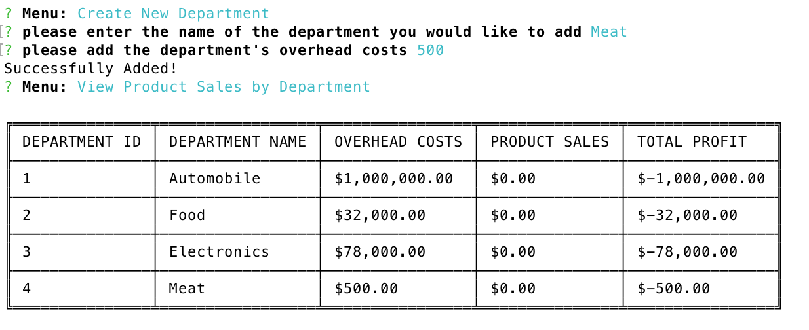

Once a new department has been created the manager can step in.  The manager can **View Products for Sale**
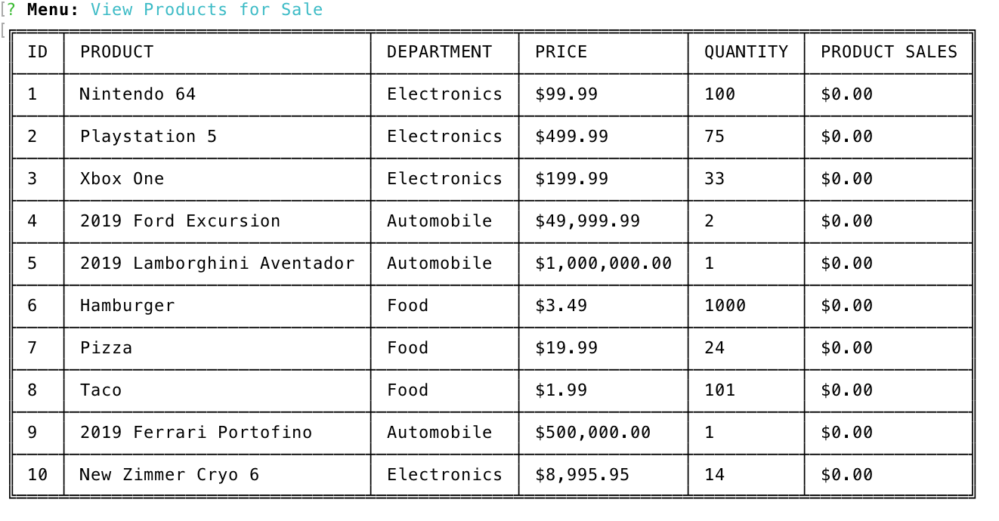

**View Low Inventory** which will display all items with inventory under 30
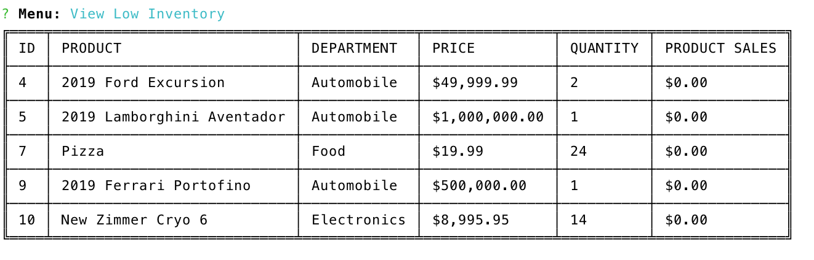

**Add to Inventory**  which prompts the user for the item ID and the quantity for which to add then updates the database.
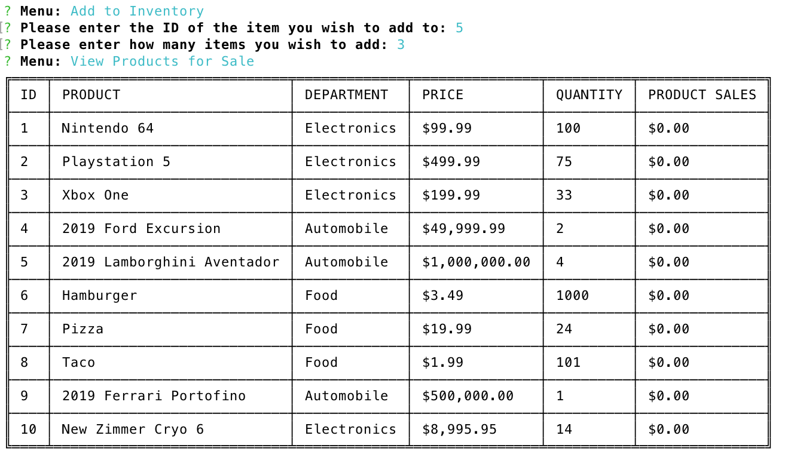

**Add Item** which prompts the manager for the item name, lets the manager choose a department from the supervisor created departments, price, and quantity.  The program then updates the database with the new product and automatically records 0 into the product sales.
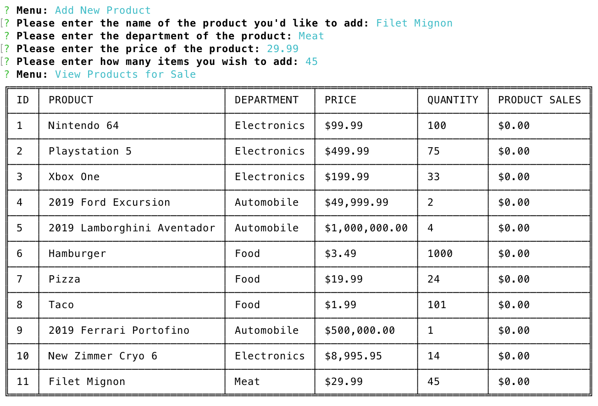

Finally the customer program allows for the customer to buy an item.  The program prompts the user for the ID of the item they wish to buy, the quantity, provides a receipt of the total cost and then records it into the database.
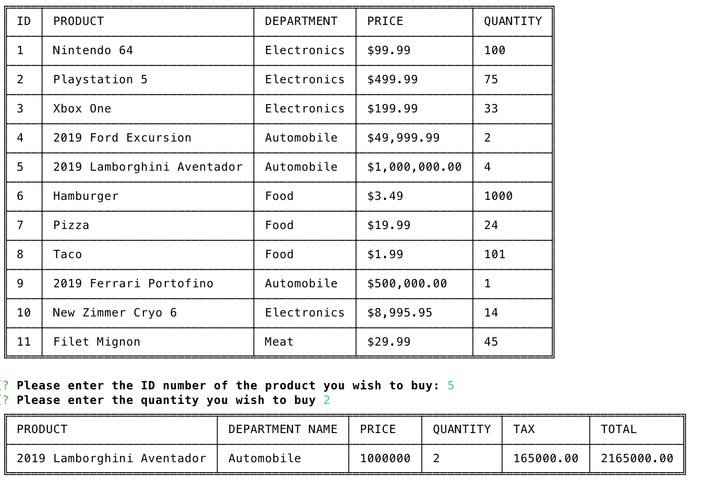

As you can see the supervisor program automatically updates with the product sales and profits.
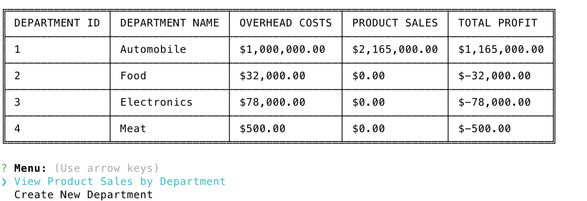

